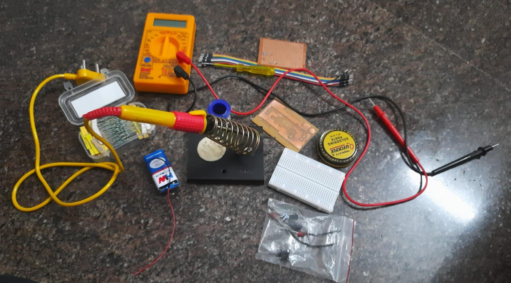
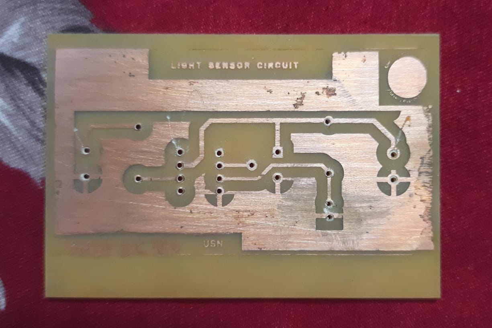

# PCB Fabrication Workshop

## Description
The PCB workshop provided hands-on experience in designing and fabricating printed circuit boards. It covered schematic design, layout, etching, drilling, and soldering techniques.

## Process Involved
- Circuit Design
- PCB Layout Design
- Printing and Etching
- Drilling
- Component Placement
- Soldering

## Tools Used
- PCB Design Software (KiCad/Proteus)
- Etching Solution
- Drilling Machine
- Soldering Kit

## Applications
- Electronics prototyping
- Embedded systems
- Circuit development

## PCB Fabrication Results

  
  

  <b>Components</b> &nbsp;&nbsp;&nbsp;&nbsp;&nbsp;&nbsp;&nbsp;&nbsp;&nbsp;&nbsp;&nbsp;&nbsp;&nbsp;&nbsp;&nbsp;&nbsp;&nbsp;&nbsp;&nbsp;&nbsp;
  <b>Etched PCB Board</b>

